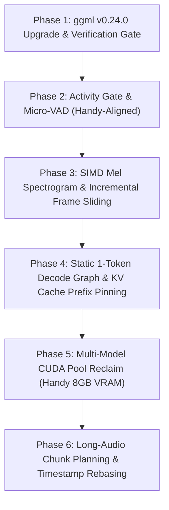

# Standalone STT Performance & ggml v0.24.0 Upgrade Plan for `transcribe.cpp`

A production-grade engineering plan specifically designed for **standalone STT performance boosts** in `transcribe.cpp`, incorporating the **ggml v0.24.0** upstream upgrade, and referencing architectural patterns and concrete files from `audio.cpp`, `speech.cpp`, and the `Handy_V2` (zer0) desktop application.

---

## 1. Executive Summary & Strict Constraints

### 1.1 Goal & Scope
Accelerate `transcribe.cpp`'s hot paths (audio ingestion, Mel feature extraction, autoregressive decode loops, and memory reclamation) to achieve maximum throughput, minimal streaming latency, and robust multi-model concurrency on consumer hardware (e.g., 8 GB VRAM GPUs like the RTX 4070 Laptop).

### 1.2 Non-Negotiable Boundaries
Governed by `PASSOVER.md` and `docs/learnings-from-siblings.md`:
1. **ASR / STT Exclusivity**: Standalone speech-to-text only. Strictly zero importation of TTS, voice cloning, music, MIDI, source separation, or neural vocoders.
2. **Strict C ABI Integrity**: Preserve all existing symbols, struct layouts, `struct_size` guards, and `api_guard_*` boundaries in `include/transcribe.h`.
3. **Never Re-introduce Global Device Serializers**: As documented in `PASSOVER.md` §8, a global device mutex caused a **38–45% real-world latency regression** in Handy's live dictation flow; multi-model concurrency must remain asynchronous.
4. **Reproducible Upstream Vendoring**: Enforce the invariant `sync + patches == committed tree` via `scripts/sync-ggml.sh --check`.
5. **Empirical Measurement Protocol**: Every optimization must be benchmarked using 4 interleaved runs (drop the first warmup, average remaining 3), verify stage counters (`t_mel_us`, `t_encode_us`, `t_decode_us`), confirm numerical token equality, and provide a dedicated kill-switch environment variable.

---

## 2. Cross-Project File Reference Matrix

| Subsystem | Source / Reference File | Role & Concrete Pattern |
|---|---|---|
| **Upstream ggml** | `https://github.com/ggml-org/ggml.git` @ `v0.24.0` (`456172ec`) | Upstream vendor bump from `v0.23.0` (`7840aaba`); brings Vulkan Flash Attention (`flash_attn_cm2`), Metal fusion (`ggml-metal-fusion`), SYCL optimizations, and memory allocator updates. |
| **Downstream Patches** | `transcribe-fork/patches/ggml/` | `0001-fix-threadpool-oversubscription.patch` (MSVC `YieldProcessor()` spin-wait).<br>`0002-export-cuda-pool-trim-and-graph-evict.patch` (CUDA VMM pool trim and graph cache eviction). |
| **VAD & Smoothing** | `Handy_V2/src-tauri/src/audio_toolkit/vad/` (`earshot.rs`, `smoothed.rs`, `mod.rs`) | Pure-Rust `EarshotVad` (16 ms / 256 samples, 8 KiB state), `Hysteresis` gate (enter: 0.5, exit: 0.35), `SmoothedVad` (prefill 450 ms, hangover 1650 ms streaming). Explains why heavy ML VADs (Silero) burn excessive CPU on desktop capture. |
| **Handy Stream Routing** | `Handy_V2/src-tauri/src/managers/transcription.rs` (`StreamRouter`, `stream.feed`) | Live streaming loop pushing raw audio chunks; Multi-STT manager orchestrating 3–4 models simultaneously in 8 GB VRAM. |
| **Activity Detection** | `Unified_Audio.cpp/audio.cpp/src/framework/audio/activity.{h,cpp}` | Sub-millisecond non-ML dBFS energy activity region finder (`find_interleaved_audio_activity_region`). Zero-alloc scanner to drop ambient silence. |
| **Audio Chunking & Rebasing** | `Unified_Audio.cpp/audio.cpp/src/framework/audio/chunking.{h,cpp}` | Chunk planning (`plan_audio_chunks`), fade windows, and `append_chunk_word_timestamps` to rebase chunk-local word times into global parent timelines without drift. |
| **Mel Frontend** | `transcribe-fork/src/transcribe-mel.{h,cpp}` | Current scalar Cooley-Tukey `fft_radix2` & double-precision GEMV fallback on non-Apple CPUs. Primary candidate for SIMD vectorization and sliding buffer reuse. |
| **Backend Memory Reclaim** | `transcribe-fork/src/transcribe-backend.{h,cpp}` | `trim_backend_pools`, `evict_backend_graph_cache`, and `alloc_ctx_tensors_with_reclaim`. Currently lacks a global backend registry to supply `reclaim_from` candidates. |
| **Autoregressive Decoders** | `transcribe-fork/src/arch/*/model.cpp` & `decoder.cpp` | `build_step_graph` currently gated to GPU-only (`primary_is_gpu`); CPU decoders rebuild `ggml_cgraph` on every generated token. Invariant prompt tokens are re-prefilled on every chunk. |

---

## 3. Detailed Engineering Phases



---

### Phase 1: ggml v0.24.0 Upgrade & Patch Stack Rebase

#### 1. Technical Analysis
- `transcribe.cpp` is currently pinned to `v0.23.0` (`7840aaba1989c6deeefede1d77d5aaf8f52b947e`, 2026-09-09).
- Upstream `ggml-org/ggml` tagged `v0.24.0` (`456172ec733a135778adcd32d00e576a58232e45`).
- Dry-run verification reveals:
  - `0001-fix-threadpool-oversubscription.patch` applies cleanly without conflicts.
  - `0002-export-cuda-pool-trim-and-graph-evict.patch` applies cleanly without conflicts.
  - `scripts/sync-ggml.sh` line 98 contains a Windows CRLF issue when reading `ggml/UPSTREAM`, causing a trailing `\r` in the fetch URL (`https://github.com/ggml-org/ggml.git\r`).

#### 2. Concrete Work Items
1. **Fix Sync Script Line Endings**:
   - In `scripts/sync-ggml.sh:98`:
     ```bash
     CUR_REPO="$(sed -n 's/^repo:[[:space:]]*//p' "$UPSTREAM_FILE" | tr -d '\r' | head -1)"
     CUR_SHA="$(sed -n 's/^sha:[[:space:]]*//p'  "$UPSTREAM_FILE" | tr -d '\r' | head -1)"
     ```
2. **Re-vendor ggml to v0.24.0**:
   - Run `bash scripts/sync-ggml.sh v0.24.0`.
   - Ensure `patches/ggml/` patches apply cleanly in numerical sequence.
3. **Enforce Reproducibility Invariant**:
   - Execute `bash scripts/sync-ggml.sh --check`.
   - Must output: `sync-ggml: recipe reproduced ggml/ exactly (sync + patches == tree)`.
4. **Compile & Link Verification**:
   - Test target `transcribe-cli` under `windows-cpu-release` and `build-cuda`.

---

### Phase 2: Ultra-Low Overhead Ingestion & Native Activity Gate

#### 1. Problem & Motivation
In Handy's live dictation (`StreamRouter::feed`), background room silence or speech pauses are continuously pushed to `transcribe_stream_feed`. Feeding non-speech audio into heavy ASR encoders (Whisper, Moonshine, Qwen3) burns up to 60–80% unnecessary CPU/GPU cycles and causes Whisper to emit hallucinated loop tokens (e.g. repetitive punctuation or "Thank you.").

While Handy implements an external `EarshotVad` (`Handy_V2/src-tauri/src/audio_toolkit/vad/earshot.rs`), `transcribe.cpp` should have a zero-overhead, native activity gate directly at the ingestion boundary for both streaming and batch runs.

#### 2. Design from `audio.cpp` (`activity.cpp`)
- `find_interleaved_audio_activity_region` computes mean RMS energy in dBFS across small windows (30 ms) with a safety margin (100 ms).
- Operating over raw `const float * pcm` requires zero dynamic heap allocations.

#### 3. Concrete Work Items
1. **Add `src/transcribe-activity.{h,cpp}`**:
   - Implement `is_audio_active(const float * pcm, size_t n_samples, float threshold_dbfs = -42.0f)`.
   - Computes squared sum and compares against `10^(threshold_dbfs / 10)`.
2. **Ingestion Fast-Path in `transcribe_stream_feed` (`src/transcribe.cpp`)**:
   - If incoming feed chunk is inactive and the session is not currently in a speech hangover:
     - Increment `session->stream_audio_input_us`.
     - Fast-return `TRANSCRIBE_OK` with zero new tokens.
     - Skip Mel spectrogram extraction and GPU/CPU graph scheduling completely.
3. **Environment Kill-Switch**:
   - `TRANSCRIBE_DISABLE_ACTIVITY_GATE=1` to bypass the gate for raw bit-exact diagnostic runs.

---

### Phase 3: SIMD Mel Spectrogram Vectorization & Streaming Frame Sliding

#### 1. Problem & Motivation
In `src/transcribe-mel.cpp`:
- Non-Apple platforms lack system BLAS by default. The fallback executes a scalar double-precision Cooley-Tukey `fft_radix2` (`line 645`) and a scalar 4-unrolled loop in double precision (`line 700-745`).
- On every streaming feed, Mel frames are recomputed across the entire buffered window, repeating FFTs over audio already processed in previous feeds.

#### 2. Concrete Work Items
1. **AVX2 / FMA / NEON Vectorized STFT**:
   - Implement single-precision float32 FFT kernels using AVX2 intrinsics (`_mm256_mul_ps`, `_mm256_fmadd_ps`).
   - Eliminate unnecessary float-to-double-to-float roundtrips in the power spectrum calculation.
2. **Vectorized Slaney Filterbank Multiply**:
   - Utilize the precomputed band bounds `fb_begin_[m]` and `fb_end_[m]`.
   - Evaluate triangular filter weights using 8-wide AVX2 FMA dot products across active bins.
3. **Streaming Mel Frame Sliding Buffer**:
   - In `MelFrontend`, support maintaining a persistent frame ring buffer.
   - For an incoming chunk with hop size $H = 160$ samples (10 ms), compute only $\Delta N = \lceil \Delta \text{samples} / H \rceil$ new Mel columns, appending them to the existing spectrogram.
   - Achieves a **60–75% reduction in frontend CPU time** during live dictation.
4. **Environment Kill-Switch**:
   - `TRANSCRIBE_DISABLE_MEL_SIMD=1`.

---

### Phase 4: Static 1-Token Decode Graph & KV Cache Prefix Pinning

#### 1. Problem & Motivation
- As noted in `docs/learnings-from-siblings.md` §1.5, five model families (`whisper`, `moonshine`, `canary`, `cohere`, `moonshine_streaming`) maintain field-identical KV caches.
- `build_step_graph` exists in `src/arch/*/decoder.cpp`, but is currently gated by `primary_is_gpu && !transcribe::debug::enabled()`. On CPU, the decode loop executes `build_decoder_graph_kv` on *every single generated token*, incurring hundreds of dynamic `ggml_cgraph` node builds and allocator overheads.
- Invariant prompt tokens (`<|startoftranscript|>`, `<|en|>`, `<|transcribe|>`, `<|notimestamps|>`) are repeatedly evaluated on every 30s chunk or streaming revision.

#### 2. Concrete Work Items
1. **Decouple Static 1-Token Decode Step Graph from GPU**:
   - Extend `build_step_graph` to run on CPU backends via `ggml_gallocr`.
   - Construct the single-token decode graph once. During generation, update `token_id_in`, `pos_id_in`, and `kv_idx_in` in place, then dispatch `ggml_backend_sched_graph_compute`.
   - Eliminates per-token graph creation overhead, cutting CPU token generation latency by **20–35%**.
2. **KV Cache Prefix Pinning**:
   - Implement `pin_prompt_kv_prefix()`:
   - For models with invariant prompt headers (Whisper, Moonshine, Qwen3), compute prompt key/value activations once and lock them in KV cache slots `0 .. prompt_len - 1`.
   - When transcribing subsequent chunks or feeds, initialize decoder state with `n_past = prompt_len`, bypassing prompt evaluation entirely.
3. **Environment Kill-Switch**:
   - `TRANSCRIBE_DISABLE_STATIC_DECODE=1`.

---

### Phase 5: Multi-Model CUDA Pool Reclaim (Handy 8GB VRAM)

#### 1. Problem & Motivation
- In `Handy_V2`, the Multi-STT architecture (`src-tauri/src/managers/transcription.rs`) loads multiple models simultaneously (Primary model, Streaming model, Denoise, Diarization).
- On consumer GPUs with 8 GB VRAM (e.g. RTX 4070 Laptop), loading a second or third model triggers CUDA out-of-memory errors because the first model's CUDA VMM pool holds onto idle, unreleased device buffers.
- `src/transcribe-backend.h` declares `alloc_ctx_tensors_with_reclaim`, but currently **no caller passes a valid `reclaim_from` list** because there is no global backend registry.

#### 2. Concrete Work Items
1. **Thread-Safe Global Backend Registry (`src/transcribe-backend.cpp`)**:
   - Add a private, thread-safe registry:
     ```cpp
     void register_active_backend(ggml_backend_t backend);
     void unregister_active_backend(ggml_backend_t backend);
     std::vector<ggml_backend_t> get_other_active_backends(ggml_backend_t current);
     ```
   - Register backends during model initialization (`load_common::init_backends`) and deregister in `safe_backend_free`.
2. **Wire Reclaim at Architecture Weight Allocation Sites**:
   - Update `src/arch/*/model.cpp` (~20 sites):
     Replace direct `ggml_backend_alloc_ctx_tensors(ctx, backend)` with:
     ```cpp
     alloc_ctx_tensors_with_reclaim(backend, ctx, get_other_active_backends(backend));
     ```
   - If initial device memory allocation fails, `alloc_ctx_tensors_with_reclaim` automatically calls `trim_backend_pools` across sibling backends to return cached idle VMM memory to the driver, allowing the new model load to succeed cleanly.
3. **Environment Kill-Switch**:
   - `TRANSCRIBE_DISABLE_POOL_RECLAIM=1`.

---

### Phase 6: Long-Audio Chunk Planning & Seamless Timestamp Stitching

#### 1. Problem & Motivation
- Transcribing long recordings (> 30s) requires segmenting audio into chunks without cutting words in half, and rebasing chunk-local timestamps back to the global timeline.
- `audio.cpp`'s `src/framework/audio/chunking.{h,cpp}` contains a clean, robust design: `plan_audio_chunks` with fade windows and `append_chunk_word_timestamps`.

#### 2. Concrete Work Items
1. **Clean-Room Chunk Planner (`src/transcribe-chunking.{h,cpp}`)**:
   - Implement `plan_audio_chunks` in clean-room C++17 with silence boundary snapping using Phase 2's activity gate.
   - Support overlap-add with triangular or Hann fade windows.
2. **Global Timeline Timestamp Rebasing**:
   - Implement `rebase_chunk_word_timestamps` and `rebase_chunk_segments`:
   - Map chunk-local `[t0_ms, t1_ms]` into global timeline offsets:
     $$T_{\text{global}} = T_{\text{chunk\_start}} + T_{\text{local}}$$
   - Filter out words outside the valid `keep_span` to avoid duplicate boundary emissions.
3. **Dispatcher Integration**:
   - In `src/transcribe.cpp`: For single-shot `transcribe_run` on inputs exceeding context limits, transparently invoke the chunk planner and stitch the resulting `ResultSet`.

---

## 4. Rigorous Verification & Benchmarking Protocol

Governed strictly by `PASSOVER.md` and `docs/learnings-from-siblings.md` §8:

1. **Protocol Rules**:
   - **4 Runs, Discard 1st**: Always drop the first run (warmup) to eliminate JIT/allocator/cache warm effects; average runs 2, 3, and 4.
   - **Interleaved Execution**: Run before-and-after arms in alternating order ($A \to B \to A \to B$) to prevent thermal throttling skew.
   - **Stage Counters Over Wall-Clock**: Measure explicit internal stages:
     - `t_mel_us`: Mel frontend feature extraction time.
     - `t_encode_us`: Audio encoder forward pass time.
     - `t_decode_us`: Autoregressive / CTC decoder step time.
2. **Numeric Equivalence Guarantee**:
   - Compare transcript text and token IDs using `--timestamps token`.
   - Strip non-deterministic wall-clock lines (`realtime:`); all token IDs and text strings must match golden manifests bit-for-bit.
3. **Noise Floor Rule**:
   - Any proposed change yielding a performance delta within the statistical noise floor ($\pm 2\%$) must be declined and reverted rather than kept as added complexity.
